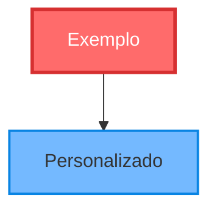
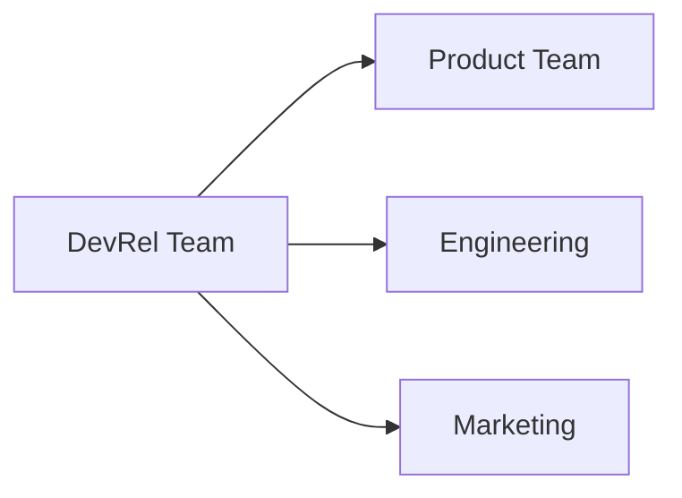
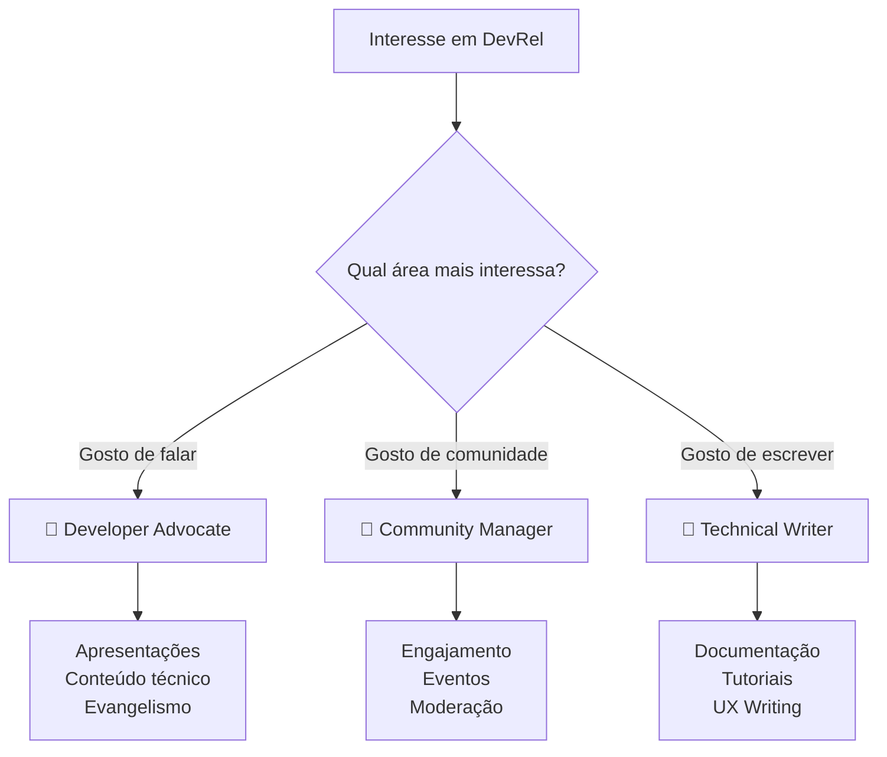
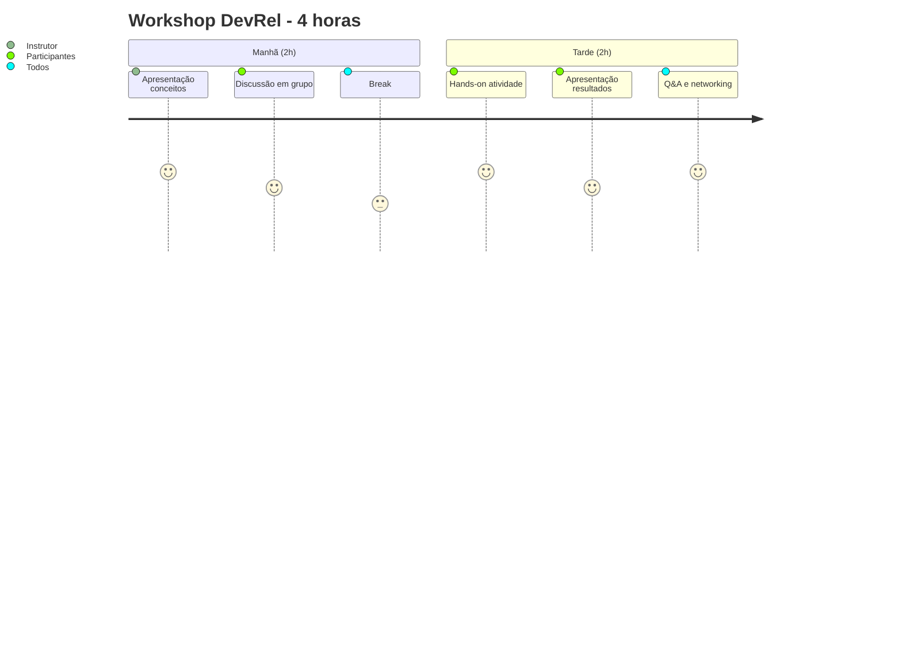
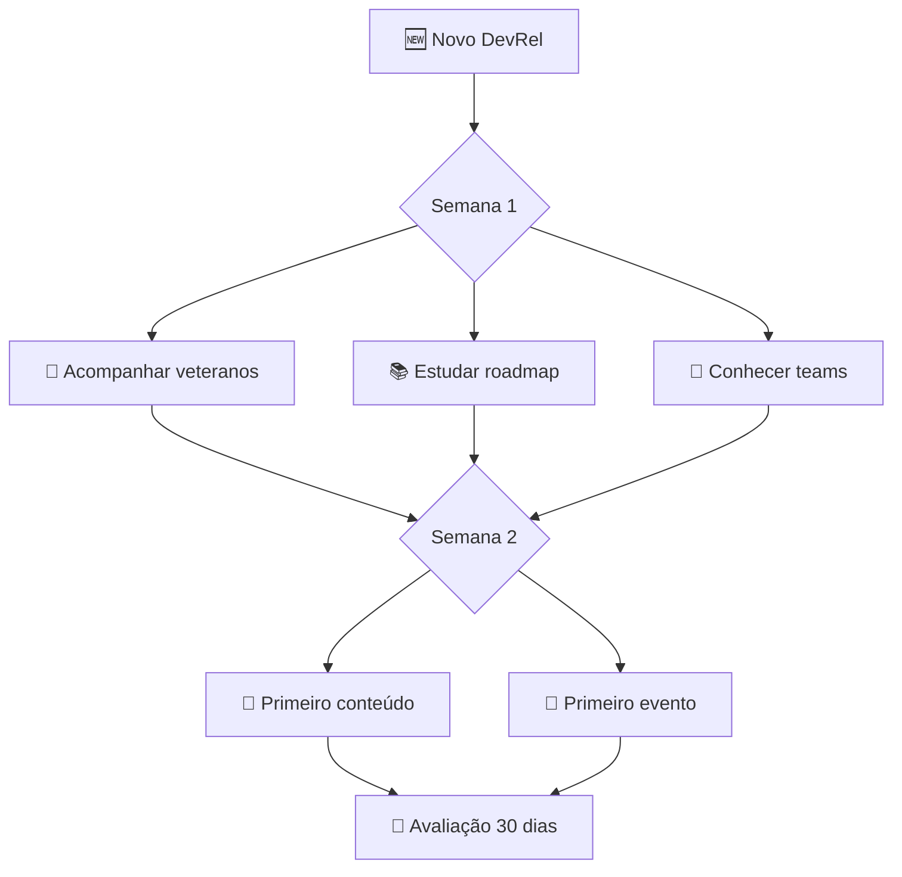
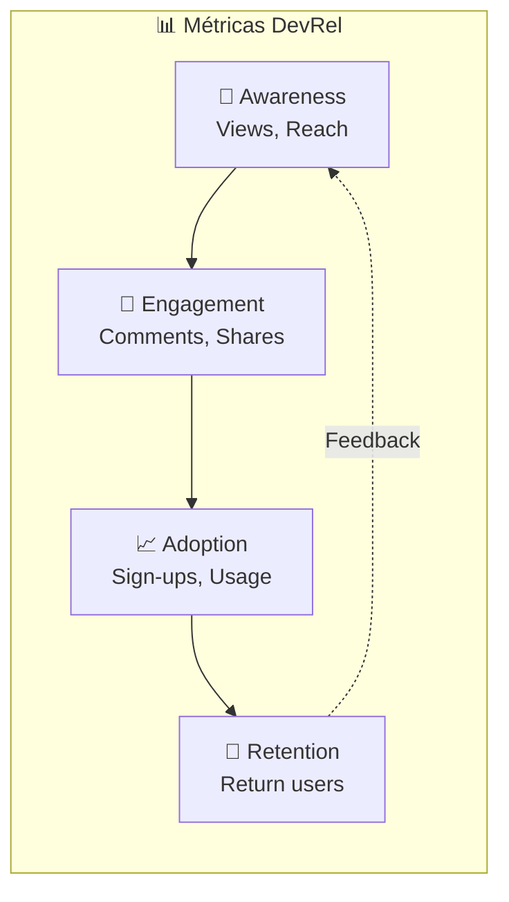

# 🎨 Guia de Uso dos Diagramas DevRel

Este guia explica como usar e personalizar os diagramas visuais do roadmap DevRel.

## 🛠️ Ferramentas Compatíveis com Mermaid

### Plataformas que Renderizam Automaticamente
- ✅ **GitHub** - Renderiza diagramas automaticamente
- ✅ **GitLab** - Suporte nativo ao Mermaid
- ✅ **VS Code** - Com extensão Mermaid Preview
- ✅ **Notion** - Suporte nativo
- ✅ **Obsidian** - Plugin Mermaid

### Ferramentas de Apresentação
- **Marp** - Markdown para slides com Mermaid
- **Reveal.js** - Apresentações web com diagramas
- **GitPitch** - Slides direto do GitHub

### Editores Online
- [Mermaid Live Editor](https://mermaid.live/) - Editor oficial
- [Draw.io](https://app.diagrams.net/) - Importa Mermaid
- [Lucidchart** - Suporte a Mermaid

## 📝 Como Personalizar os Diagramas

### 1. Modificar Cores e Estilos

### 2. Adaptar para Sua Empresa

### 3. Focar em Roles Específicos

## 🎯 Templates para Diferentes Usos

### Para Workshops/Treinamentos

### Para Onboarding

### Para Métricas

## 🎨 Dicas de Design

### Cores Recomendadas
- **Fundamentos**: Verde claro (`#e8f5e8`)
- **Habilidades**: Azul claro (`#e3f2fd`)
- **Prática**: Laranja claro (`#fff3e0`)
- **Roles**: Roxo claro (`#f3e5f5`)

### Ícones Úteis
- 🚀 Início/Objetivo
- 📚 Aprendizado
- 🛠️ Habilidades
- 🎯 Prática
- 📊 Métricas
- 👥 Comunidade
- 💻 Técnico
- 📝 Conteúdo

## 🔄 Atualizando os Diagramas

1. **Clone o repositório**
2. **Edite os arquivos .md**
3. **Teste no Mermaid Live Editor**
4. **Faça commit das mudanças**
5. **Veja a renderização no GitHub**

---

**💡 Lembre-se**: Os diagramas são ferramentas para facilitar o entendimento. Adapte-os às suas necessidades!
