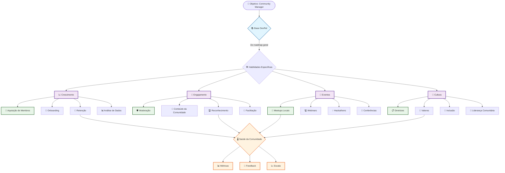
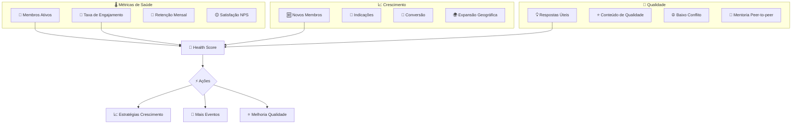
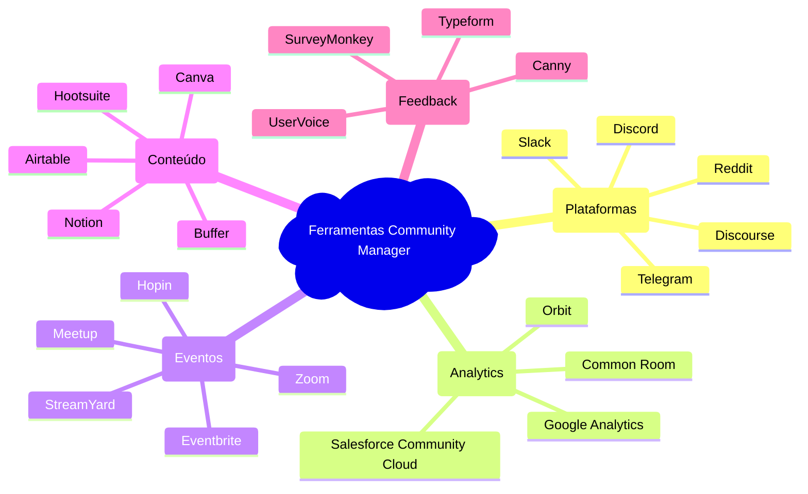
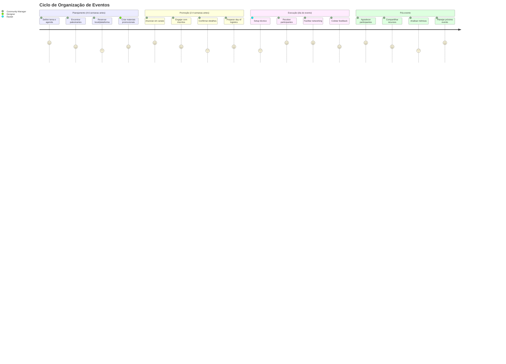
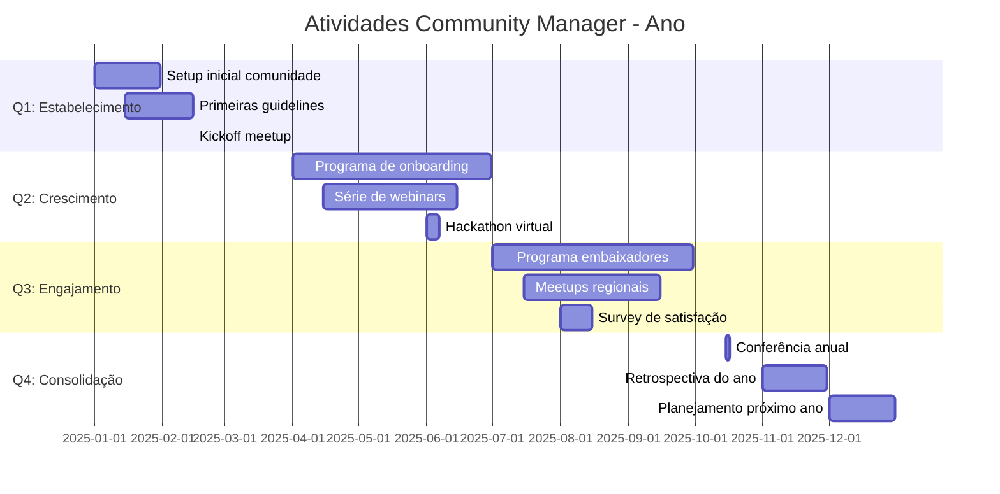

# 👥 Community Manager - Roadmap Visual

Visualizações específicas para a jornada de um Community Manager em DevRel.

## 🗺️ Jornada do Community Manager

## 🎯 Competências por Nível

```mermaid
graph LR
    subgraph "🌱 Community Manager Iniciante"
        A1[Moderar primeiro canal]
        A2[Organizar atividade online]
        A3[Acolher novos membros]
        A4[Criar primeiro post engajador]
    end
    
    subgraph "🌿 Community Manager Intermediário"
        B1[Organizar meetup presencial]
        B2[Implementar programa reconhecimento]
        B3[Analisar métricas comunidade]
        B4[Facilitar discussões complexas]
        B5[Recrutar moderadores voluntários]
    end
    
    subgraph "🌳 Community Manager Sênior"
        C1[Estratégia multi-plataforma]
        C2[Liderar equipe de CMs]
        C3[Influenciar produto via feedback]
        C4[Partnerships com outras comunidades]
        C5[Scaling para milhares de membros]
    end
    
    A1 --> A2 --> A3 --> A4
    A4 --> B1 --> B2 --> B3 --> B4 --> B5
    B5 --> C1 --> C2 --> C3 --> C4 --> C5
    
    classDef iniciante fill:#e8f5e8,stroke:#2e7d32
    classDef intermediario fill:#fff3e0,stroke:#f57f17
    classDef senior fill:#e3f2fd,stroke:#1565c0
    
    class A1,A2,A3,A4 iniciante
    class B1,B2,B3,B4,B5 intermediario
    class C1,C2,C3,C4,C5 senior
```

## 📊 Health Score da Comunidade

## 🛠️ Ferramentas por Categoria

## 🎪 Ciclo de Eventos

## 📅 Cronograma Anual de Atividades

---

💡 **Lembre-se**: Este roadmap visual complementa o [Roadmap Geral](../roadmaps/roadmap-geral.md) e o [Community Manager textual](../roadmaps/community-manager.md)!
