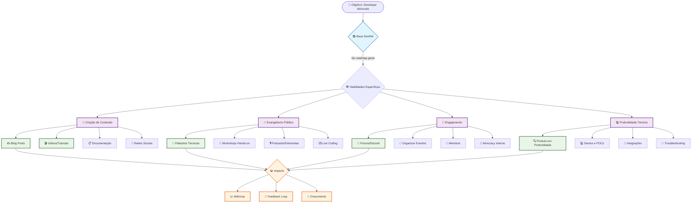
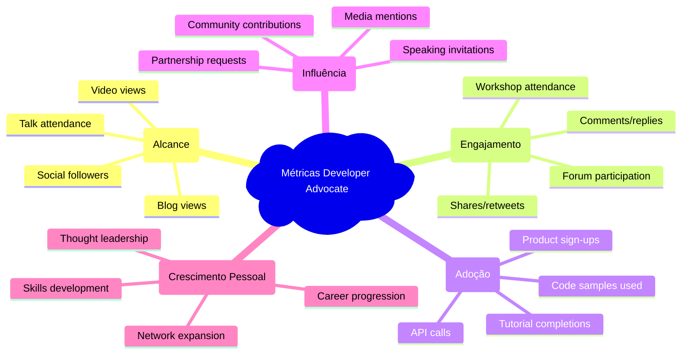
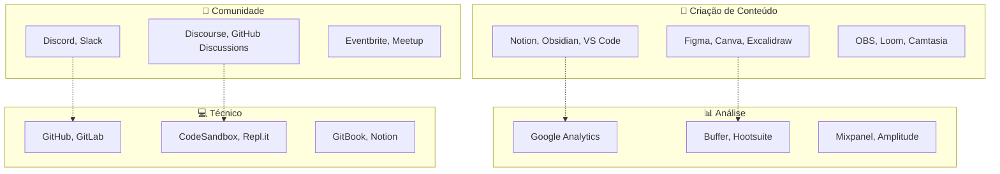
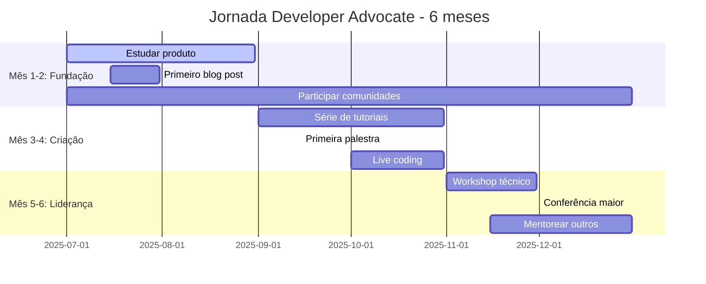

# 🎤 Developer Advocate - Roadmap Visual

Visualizações específicas para a jornada de um Developer Advocate.

## 🗺️ Jornada do Developer Advocate

## 🎯 Competências por Nível

```mermaid
graph LR
    subgraph "🌱 Developer Advocate Iniciante"
        A1[Primeiro blog post técnico]
        A2[Primeira apresentação]
        A3[Participar ativamente em fóruns]
        A4[Conhecer produto básico]
    end
    
    subgraph "🌿 Developer Advocate Intermediário"
        B1[Falar em conferências]
        B2[Criar série de tutoriais]
        B3[Organizar meetup]
        B4[Contribuir para docs]
        B5[Influenciar roadmap]
    end
    
    subgraph "🌳 Developer Advocate Sênior"
        C1[Keynote em grandes eventos]
        C2[Liderar estratégia conteúdo]
        C3[Mentorear outros advocates]
        C4[Partnerships técnicas]
        C5[Thought leadership]
    end
    
    A1 --> A2 --> A3 --> A4
    A4 --> B1 --> B2 --> B3 --> B4 --> B5
    B5 --> C1 --> C2 --> C3 --> C4 --> C5
    
    classDef iniciante fill:#e8f5e8,stroke:#2e7d32
    classDef intermediario fill:#fff3e0,stroke:#f57f17
    classDef senior fill:#e3f2fd,stroke:#1565c0
    
    class A1,A2,A3,A4 iniciante
    class B1,B2,B3,B4,B5 intermediario
    class C1,C2,C3,C4,C5 senior
```

## 📊 Métricas de Sucesso

## 🛠️ Ferramentas Essenciais

## 📅 Cronograma Sugerido (6 meses)

---

💡 **Lembre-se**: Este roadmap é baseado no [Roadmap Geral](../roadmaps/roadmap-geral.md). Use ambos para uma experiência completa!
