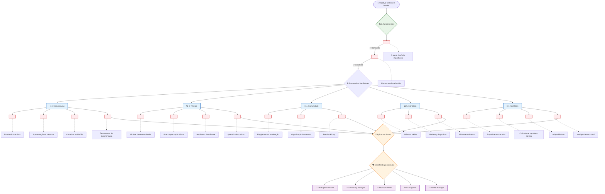

# 🚀 Roadmap Interativo DevRel

Este é um roadmap visual interativo que você pode usar para navegar pelo seu aprendizado em DevRel.

## 🗺️ Roadmap Completo com Checkboxes

## 📋 Checklist de Progresso

### 📚 Fundamentos
- [ ] Compreender o que é DevRel e sua importância
- [ ] Desenvolver mindset DevRel
- [ ] Identificar área de interesse

### 📝 Comunicação e Conteúdo
- [ ] Escrever primeiro artigo técnico
- [ ] Fazer primeira apresentação
- [ ] Criar conteúdo em vídeo
- [ ] Dominar ferramentas de documentação

### 💻 Conhecimento Técnico
- [ ] Entender fluxo de trabalho de desenvolvimento
- [ ] Usar Git e GitHub ativamente
- [ ] Compreender arquiteturas básicas
- [ ] Aprender tecnologia de um produto específico

### 👥 Construção de Comunidades
- [ ] Participar ativamente de comunidades
- [ ] Moderar discussões online
- [ ] Organizar ou participar de evento
- [ ] Implementar um feedback loop

### 📊 Estratégia e Negócios
- [ ] Definir métricas para uma iniciativa
- [ ] Criar proposta de valor para desenvolvedores
- [ ] Alinhar-se com equipe de produto

### 🧠 Habilidades Comportamentais
- [ ] Praticar escuta ativa em comunidades
- [ ] Demonstrar curiosidade técnica
- [ ] Adaptar-se a mudanças de tecnologia
- [ ] Exercitar inteligência emocional

## 🎯 Marcos de Progresso

### 🌱 **Nível Iniciante** (0-6 meses)
- ✅ Compreende DevRel
- ✅ Produz conteúdo básico
- ✅ Interage em comunidades
- ✅ Tem noções técnicas

### 🌿 **Nível Intermediário** (6-18 meses)
- ✅ Produz conteúdo regularmente
- ✅ Organiza eventos
- ✅ Coleta e aplica feedback
- ✅ Compreende métricas

### 🌳 **Nível Avançado** (18+ meses)
- ✅ Lidera iniciativas de comunidade
- ✅ Influencia roadmap de produto
- ✅ Desenvolve estratégia DevRel
- ✅ Mentora outros profissionais

---

**💡 Dica**: Use este roadmap como um guia, não como uma regra rígida. Cada jornada é única!
