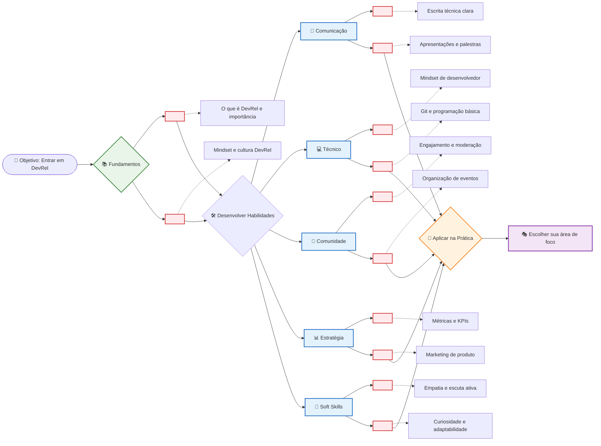

# 🚀 Roadmap Interativo DevRel

Este é um roadmap visual interativo que você pode usar para navegar pelo seu aprendizado em DevRel.

## 🗺️ Roadmap Completo com Checkboxes

## 📋 Checklist de Progresso

### 📚 Fundamentos
- [ ] Compreender o que é DevRel e sua importância
- [ ] Desenvolver mindset DevRel

### 📝 Comunicação e Conteúdo
- [ ] Escrever primeiro artigo técnico
- [ ] Fazer primeira apresentação

### 💻 Conhecimento Técnico
- [ ] Entender fluxo de trabalho de desenvolvimento
- [ ] Usar Git e GitHub ativamente

### 👥 Construção de Comunidades
- [ ] Participar ativamente de comunidades
- [ ] Organizar ou moderar evento/discussão

### 📊 Estratégia e Negócios
- [ ] Definir métricas para uma iniciativa
- [ ] Criar proposta de valor para desenvolvedores

### 🧠 Habilidades Comportamentais
- [ ] Praticar escuta ativa em comunidades
- [ ] Demonstrar curiosidade e adaptabilidade

**💡 Dica**: Use este roadmap como um guia, não como uma regra rígida. Cada jornada é única!
