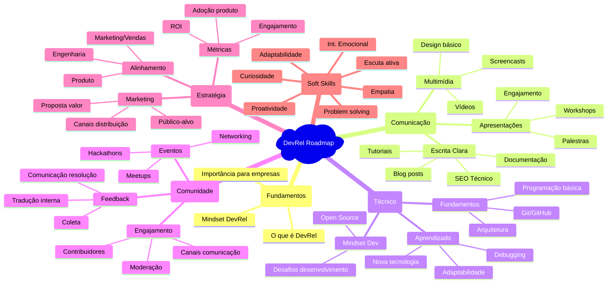
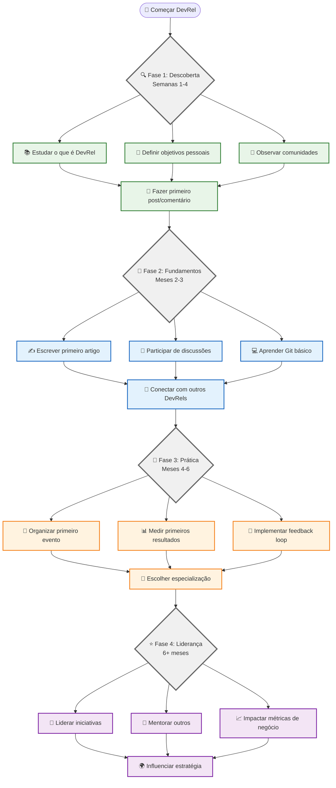
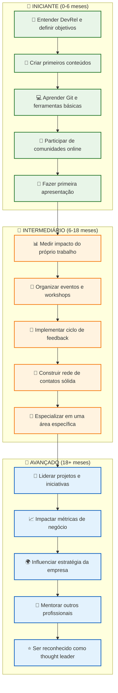
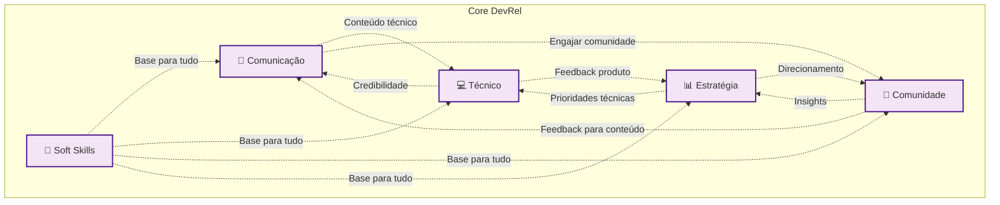
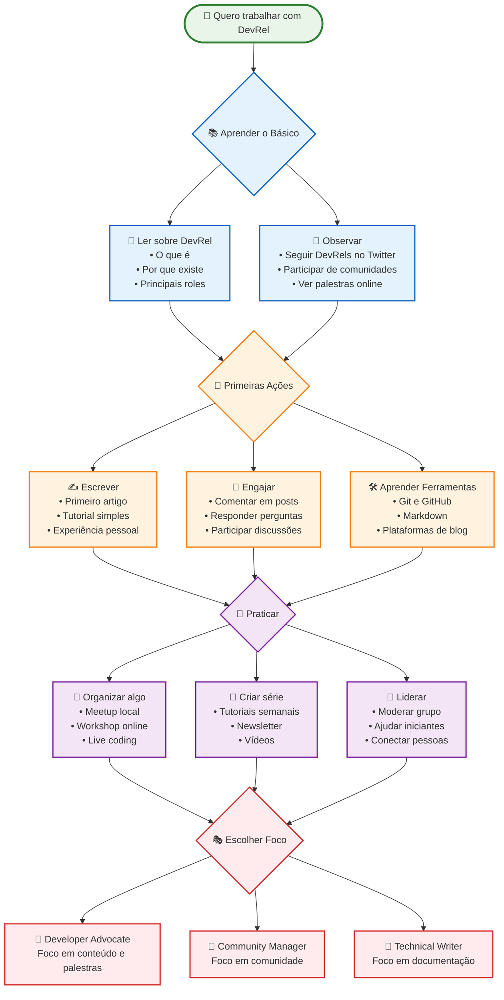

poder# 🗺️ Roadmap Visual DevRel - Versões Alternativas

Este arquivo contém diferentes visualizações do roadmap para diferentes necessidades e preferências visuais.

## 🎯 Qual versão usar?

- 🚀 **[Versão Simples](#-versão-simples-e-prática)** - Para quem está começando e quer um caminho claro
- 🧠 **[Mindmap Detalhado](#-versão-detalhada-por-competências)** - Para visão completa das competências ⭐ **RECOMENDADO**
- 📈 **[Por Níveis](#-versão-por-níveis-de-proficiência)** - Para avaliar onde você está
- 🚶 **[Jornada](#-versão-por-jornada-de-aprendizado)** - Para entender progressão temporal
- 🔄 **[Interconectada](#-versão-interconectada-trilhas-que-se-complementam)** - Para ver como tudo se relaciona

## 📊 Versão Detalhada por Competências

## 🎯 Versão por Jornada de Aprendizado

## 📈 Versão por Níveis de Proficiência

### 📋 Checklist por Nível

#### 🌱 **Iniciante** - Primeiros Passos
- [ ] Leu sobre DevRel e entende o conceito
- [ ] Definiu objetivos pessoais na área
- [ ] Criou perfil em plataformas de dev (GitHub, LinkedIn)
- [ ] Escreveu primeiro artigo ou tutorial
- [ ] Participou ativamente de pelo menos 2 comunidades
- [ ] Fez primeira apresentação (meetup, webinar)
- [ ] Aprendeu Git e colaborou em projeto open source

#### 🌿 **Intermediário** - Construindo Impacto
- [ ] Produz conteúdo regularmente (semanal/quinzenal)
- [ ] Organizou ou co-organizou evento
- [ ] Implementou sistema de coleta de feedback
- [ ] Mede o impacto do próprio trabalho
- [ ] Tem rede sólida de contatos na área
- [ ] Escolheu especialização (Advocate, Community Manager, etc.)
- [ ] Influencia roadmap de produto com feedback da comunidade

#### 🌳 **Avançado** - Liderança e Influência
- [ ] Lidera equipe ou projetos estratégicos
- [ ] Suas iniciativas impactam métricas de negócio
- [ ] É consultado para decisões estratégicas
- [ ] Mentora outros profissionais DevRel
- [ ] É reconhecido como referência na comunidade
- [ ] Fala em grandes conferências internacionais
- [ ] Contribui para evolução da área DevRel

## 🔄 Versão Interconectada (Trilhas que se Complementam)

## 🚀 Versão Simples e Prática

**💡 Como usar este diagrama:**
- 🏁 **Comece pelo topo** e siga as setas
- 🔄 **Você pode fazer várias coisas em paralelo** - não precisa ser linear
- 🎯 **Não se preocupe em ser perfeito** - o importante é começar
- 📈 **Cada ação te dará mais clareza** sobre o que gosta

---

## 🎯 Como Usar Estas Visualizações

### 🆕 **Se você é novo em DevRel:**
1. Comece com a **[Versão Simples](#-versão-simples-e-prática)** para ter um caminho claro
2. Use o **[Mindmap de Competências](#-versão-detalhada-por-competências)** para explorar áreas específicas
3. Acompanhe seu progresso com o **[Roadmap Interativo](./roadmap-interativo.md)**

### 🎯 **Para planejamento e estudo:**
- **Mindmap**: Entender todas as competências necessárias
- **Por Níveis**: Avaliar onde você está e definir próximos passos
- **Jornada**: Planejar cronograma de aprendizado

### 🎤 **Para apresentações:**
- **Versão Simples**: Explicar DevRel para iniciantes
- **Interconectada**: Mostrar complexidade e relacionamentos
- **Mindmap**: Demonstrar abrangência da área

### 💡 **Dicas de uso:**
- ✅ **Não tente fazer tudo ao mesmo tempo** - escolha 2-3 áreas para focar
- 🔄 **É um processo iterativo** - você vai voltar e aprofundar áreas
- 🎯 **Adapte ao seu contexto** - nem tudo se aplica a todas as situações
- 🤝 **Compartilhe e discuta** - DevRel é sobre comunidade!

Cada visualização serve para um propósito diferente no seu aprendizado!
