## Roadmap de Aprendizado em Developer Relations (DevRel)

Este roadmap é um guia de estudos e habilidades para quem deseja entrar ou se aprofundar em Developer Relations. Ele começa pelo porquê, passa pelas habilidades essenciais e te orienta na prática.

## 🗺️ Visão Visual do Roadmap

```mermaid
graph TD
    Start([🚀 Começar DevRel]) --> Foundation{1. Fundamentos DevRel}
    
    Foundation --> |Entender o porquê| Importance[📋 O que é DevRel<br/>e por que é importante]
    Importance --> Skills{Escolha suas trilhas}
    
    Skills --> Communication[2. 📝 Comunicação<br/>e Conteúdo]
    Skills --> Technical[3. 💻 Conhecimento<br/>Técnico]
    Skills --> Community[4. 👥 Construção de<br/>Comunidades]
    Skills --> Strategy[5. 📊 Estratégia<br/>e Negócios]
    Skills --> Soft[6. 🧠 Habilidades<br/>Comportamentais]
    
    %% Trilha Comunicação
    Communication --> CommWritten[✍️ Escrita Eficaz]
    Communication --> CommOral[🎤 Apresentações]
    Communication --> CommMultimedia[🎬 Conteúdo Multimídia]
    Communication --> CommTools[🛠️ Ferramentas]
    
    %% Trilha Técnica
    Technical --> TechMindset[🧠 Mindset Dev]
    Technical --> TechFundamentals[⚙️ Fundamentos]
    Technical --> TechArchitecture[🏗️ Arquitetura]
    Technical --> TechLearning[📚 Aprendizado Contínuo]
    
    %% Trilha Comunidade
    Community --> CommunityEngagement[🤝 Engajamento]
    Community --> CommunityEvents[🎪 Eventos]
    Community --> CommunityFeedback[🔄 Feedback Loop]
    
    %% Trilha Estratégia
    Strategy --> StrategyMetrics[📈 Métricas e KPIs]
    Strategy --> StrategyMarketing[🎯 Marketing de Produto]
    Strategy --> StrategyAlignment[🤝 Alinhamento Interno]
    
    %% Trilha Soft Skills
    Soft --> SoftEmpathy[❤️ Empatia]
    Soft --> SoftListening[👂 Escuta Ativa]
    Soft --> SoftCuriosity[🔍 Curiosidade]
    Soft --> SoftProblemSolving[🧩 Resolução de Problemas]
    Soft --> SoftAdaptability[🔄 Adaptabilidade]
    Soft --> SoftEQ[🧠 Inteligência Emocional]
    Soft --> SoftProactive[⚡ Proatividade]
    
    %% Convergência para prática
    CommWritten --> Practice{Aplicar na Prática}
    CommOral --> Practice
    TechMindset --> Practice
    CommunityEngagement --> Practice
    StrategyMetrics --> Practice
    SoftEmpathy --> Practice
    
    Practice --> DevAdvocate[🎤 Developer Advocate]
    Practice --> CommunityManager[👥 Community Manager]
    Practice --> TechWriter[📝 Technical Writer]
    Practice --> DXEngineer[⚙️ DX Engineer]
    Practice --> DevRelManager[👔 DevRel Manager]
    
    %% Styling
    classDef foundationClass fill:#e1f5fe,stroke:#01579b,stroke-width:2px
    classDef skillClass fill:#f3e5f5,stroke:#4a148c,stroke-width:2px
    classDef practiceClass fill:#e8f5e8,stroke:#1b5e20,stroke-width:2px
    classDef roleClass fill:#fff3e0,stroke:#e65100,stroke-width:2px
    
    class Foundation,Importance foundationClass
    class Communication,Technical,Community,Strategy,Soft skillClass
    class Practice practiceClass
    class DevAdvocate,CommunityManager,TechWriter,DXEngineer,DevRelManager roleClass
```

**Como ler este diagrama:**
- 🚀 **Comece pelo topo**: entenda o que é DevRel e sua importância
- 📚 **Escolha suas trilhas**: você pode focar em áreas específicas ou estudar todas
- 🔄 **É iterativo**: você pode voltar e aprofundar áreas conforme ganha experiência
- 🎯 **Roles específicos**: cada trilha contribui para diferentes roles em DevRel

----------

### 1. O que é DevRel e por que ele é Importante?

Antes de mergulhar nas habilidades, é fundamental entender o cerne do Developer Relations.

-   Definição de DevRel:
    

-   Não é marketing puro, não é engenharia pura, e não é apenas suporte. DevRel é a ponte entre uma empresa e a comunidade de desenvolvedores que usa (ou poderia usar) seus produtos e tecnologias. É sobre construir e manter relacionamentos, educar, e advogar pelos desenvolvedores dentro da empresa.
    
-   Profissionais de DevRel atuam como a ponte entre a empresa e as pessoas desenvolvedoras.
    

-   A Importância do DevRel para as Empresas:
    

-   Adoção e Engajamento: Ajuda a trazer novos desenvolvedores para a plataforma e a mantê-los engajados.
    
-   Feedback e Melhoria de Produto: Canaliza o feedback direto da comunidade para as equipes de produto e engenharia, garantindo que o produto atenda às necessidades reais dos desenvolvedores.
    
-   Construção de Comunidade: Cria um ecossistema vibrante onde os desenvolvedores podem aprender, compartilhar e ajudar uns aos outros.
    
-   Confiança e Credibilidade: Constrói uma reputação de empresa que se importa com seus desenvolvedores e suas ferramentas.
    
-   Inovação: Desenvolvedores externos podem criar usos inesperados e inovadores para a tecnologia.
    
-   Marketing "Autêntico": Em vez de publicidade direta, o DevRel foca em valor e utilidade, o que ressoa mais com a comunidade de desenvolvedores.
    

----------

### 2. Trilha: Fundamentos de Comunicação e Conteúdo

A espinha dorsal do DevRel é a capacidade de comunicar efetivamente com desenvolvedores e criar materiais que os ajudem.

-   Comunicação Escrita Eficaz:
    

-   Técnicas de Escrita Clara e Concisa: Como redigir tutoriais, documentação e artigos técnicos. O foco é na clareza e na capacidade de transformar conceitos complexos em algo fácil de entender.
    
-   Storytelling Técnico: Como contar uma história que ressoe com desenvolvedores, usando exemplos e casos de uso práticos.
    
-   Noções de SEO para Conteúdo Técnico: Como garantir que seu conteúdo seja encontrado por quem precisa, usando as palavras-chave certas e formatos otimizados.
    

-   Comunicação Oral e Apresentação:
    

-   Técnicas de Apresentação: Estrutura de palestras impactantes, uso de slides que apoiam a mensagem e linguagem corporal eficaz.
    
-   Engajamento da Audiência: Como manter o público interessado, interagir em tempo real e responder a perguntas de forma construtiva.
    
-   Workshop Facilitation: Habilidades para guiar sessões práticas e interativas, garantindo que os participantes alcancem os objetivos de aprendizado.
    

-   Criação de Conteúdo Multimídia:
    

-   Noções de Edição de Vídeo: Para tutoriais, screencasts e demonstrações de produtos. Não precisa ser um expert, mas entender o básico para criar ou colaborar na criação.
    
-   Design Básico (UI/UX): Para criar materiais visuais claros e atraentes, como diagramas, infográficos e apresentações que sejam intuitivas para desenvolvedores.
    

-   Ferramentas e Plataformas de Conteúdo:
    

-   Familiaridade com Sistemas de Documentação (ex: Read the Docs, GitBook).
    
-   Experiência com Plataformas de Blog (ex: Medium, Dev.to).
    
-   Noções de Plataformas de Vídeo (ex: YouTube, Vimeo).
    

----------

### 3. Trilha: Conhecimento Técnico

Ter uma base técnica sólida é crucial para ganhar a confiança dos desenvolvedores, mesmo que as tecnologias específicas variem. A chave é a curiosidade e a capacidade de aprender a tecnologia do produto em questão.

-   Mindset de Desenvolvedor:
    

-   Compreensão dos Desafios de Desenvolvimento: Entender as dores, os fluxos de trabalho e as prioridades de um desenvolvedor no dia a dia. Isso inclui desde a depuração de código até a escolha de ferramentas e a integração de diferentes sistemas.
    
-   Cultura de Código Aberto (Open Source): Entender como funciona, a importância das comunidades, como contribuir e os benefícios para a adoção de tecnologia.
    

-   Fundamentos de Lógica e Sistemas:
    

-   Princípios Básicos de Programação: Não é necessário dominar uma linguagem específica, mas entender conceitos como variáveis, estruturas de controle, funções e paradigmas (orientação a objetos, funcional). Isso ajuda a ler e compreender exemplos de código, independentemente da linguagem.
    
-   Versionamento de Código (Git & Plataformas como GitHub/GitLab): Essencial para colaborar em projetos, entender o histórico de mudanças, gerenciar código e interagir com repositórios da comunidade.
    

-   Noções de Arquitetura de Software (Conceitos Gerais):
    

-   Como Sistemas se Comunicam: Compreensão básica de redes, cliente-servidor, componentes de software. Não precisa ser um arquiteto, mas entender a "big picture" ajuda a contextualizar o produto.
    
-   Ciclo de Vida do Software: Desde o planejamento e desenvolvimento até o deploy, manutenção e obsolescência. Entender como o feedback da comunidade se encaixa nesse ciclo.
    

-   Capacidade de Aprendizado Contínuo e Adaptabilidade:
    

-   Disposição para Aprender a Tecnologia do Produto: A habilidade mais crítica aqui é a de mergulhar no ecossistema técnico específico do produto que você vai representar. Seja ele focado em nuvem, mobile, web, IoT, etc. Isso significa ler documentação, testar o produto, e conversar com a equipe de engenharia e produto.
    
-   Depuração e Resolução de Problemas: A habilidade de investigar erros, ler logs e usar documentação para encontrar soluções. Isso é crucial para ajudar desenvolvedores e dar feedback interno.
    

----------

### 4. Trilha: Construção e Gestão de Comunidades

O coração do DevRel é a comunidade. Saber como nutri-la é fundamental para o sucesso de qualquer produto tecnológico.

-   Estratégias de Engajamento:
    

-   Criação e Gestão de Canais de Comunicação: Fóruns, Discord, Slack, Stack Overflow – como criar um ambiente acolhedor, moderar discussões e manter a comunidade ativa.
    
-   Moderação e Suporte à Comunidade: Como manter um ambiente saudável, resolver conflitos de forma construtiva e oferecer suporte técnico básico ou direcionar para os recursos certos.
    
-   Identificação e Apoio a Contribuidores: Como incentivar e reconhecer desenvolvedores que contribuem com a comunidade (ex: criando tutoriais, respondendo perguntas) ou com o código (ex: enviando pull requests).
    

-   Organização e Participação em Eventos:
    

-   Planejamento de Meetups e Webinars: Desde a definição da agenda e seleção de palestrantes até a logística e promoção.
    
-   Participação em Hackathons e Conferências: Como representar a empresa, engajar participantes, apresentar a tecnologia e coletar feedback valioso.
    
-   Estratégias para Fazer Networking: Construir relacionamentos genuínos com outros profissionais de tecnologia, influenciadores e parceiros.
    

-   Feedback Loop:
    

-   Coleta de Feedback da Comunidade: Utilização de ferramentas e métodos (pesquisas, entrevistas, sessões de "listening") para entender as necessidades, dores e aspirações dos desenvolvedores.
    
-   Encaminhamento para Equipes Internas: Como traduzir o feedback da comunidade em insights acionáveis para as equipes de engenharia e produto, influenciando o roadmap do produto.
    
-   Comunicação da Resolução: Mostrar à comunidade que o feedback foi ouvido e que as ações estão sendo tomadas, construindo confiança e lealdade.
    

----------

### 5. Trilha: Estratégia e Negócios (Mindset de Produto)

DevRel não é apenas técnico ou de comunicação; ele é uma função estratégica que serve a objetivos de negócio e se integra ao ciclo de vida do produto.

-   Métricas e KPIs em DevRel:
    

-   Adoção de Produtos/Tecnologias: Medir downloads, uso ativo, novas integrações e número de novos projetos ou desenvolvedores ativos.
    
-   Engajamento da Comunidade: Quantificar membros, atividades em fóruns, contribuições de conteúdo ou código, e participação em eventos.
    
-   Impacto no Negócio: Compreender como as iniciativas de DevRel contribuem para a retenção de usuários, aquisição de novos desenvolvedores/clientes e o retorno sobre investimento (ROI) geral para a empresa.
    

-   Noções de Marketing de Produto e Posicionamento:
    

-   Identificação do Público-Alvo: Quais segmentos de desenvolvedores a empresa deseja alcançar e por que, entendendo suas motivações e necessidades.
    
-   Proposta de Valor: Articular claramente por que a tecnologia é útil, quais problemas ela resolve para os desenvolvedores e como se diferencia dos concorrentes.
    
-   Canais de Distribuição de Conteúdo: Onde encontrar e engajar seu público de desenvolvedores de forma eficaz, seja em blogs técnicos, redes sociais, ou eventos.
    

-   Alinhamento com Equipes Internas:
    

-   Parceria com Engenharia: Para entender profundamente a tecnologia, identificar oportunidades de melhoria e coletar feedback técnico.
    
-   Parceria com Produto: Para influenciar o roadmap do produto com insights e feedback direto da comunidade de desenvolvedores.
    
-   Parceria com Marketing e Vendas: Para garantir que as mensagens sejam coesas, que as iniciativas de DevRel apoiem os objetivos de negócio mais amplos e que haja sinergia entre as áreas.
    

----------

### 6. Trilha: Habilidades Comportamentais (Soft Skills)

Cruciais para qualquer função, mas absolutamente essenciais em DevRel, onde a interação humana é constante e a construção de relacionamentos é o cerne do trabalho.

-   Empatia: A capacidade de se colocar no lugar dos desenvolvedores, entender suas dores, frustrações e necessidades, e comunicar-se de uma forma que ressoe com eles.
    
-   Escuta Ativa: Ouvir atentamente para compreender, não apenas para responder, captando nuances e preocupações que nem sempre são ditas explicitamente.
    
-   Curiosidade: Vontade genuína de aprender novas tecnologias, explorar soluções, e se manter atualizado no ecossistema técnico e nas tendências da comunidade.
    
-   Resolução de Problemas: Capacidade de abordar desafios técnicos e comunitários de forma lógica, criativa e eficaz, buscando soluções e ajudando a comunidade.
    
-   Adaptabilidade: Flexibilidade para se ajustar a novas ferramentas, tecnologias, plataformas e estratégias conforme o cenário evolui e as necessidades da comunidade mudam.
    
-   Inteligência Emocional: Gerenciar suas próprias emoções e entender as dos outros, promovendo um ambiente de colaboração, respeito e confiança.
    
-   Proatividade: Tomar a iniciativa para criar valor, identificar oportunidades para engajar a comunidade e resolver problemas antes que se tornem maiores.
