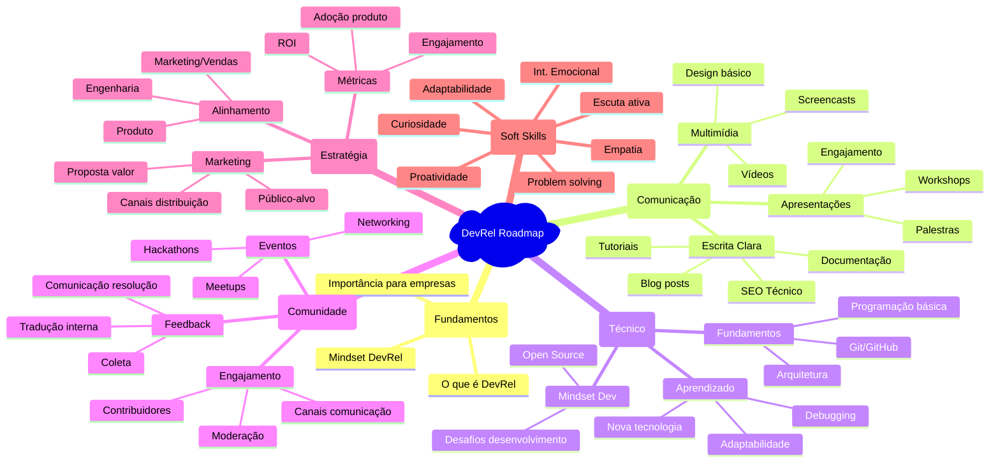
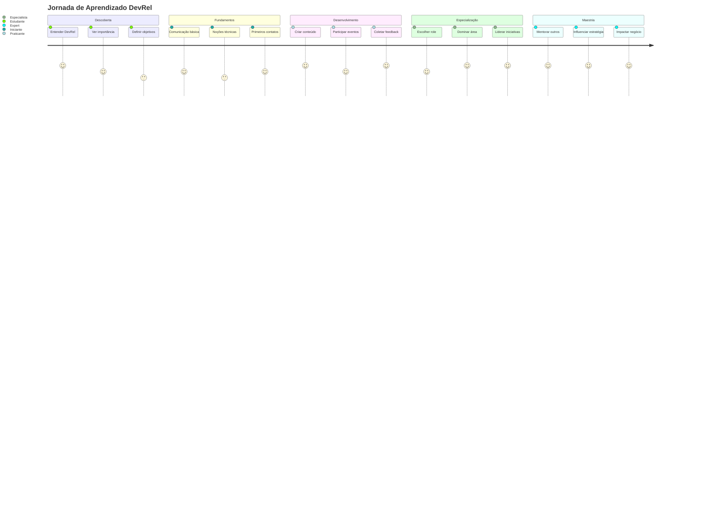
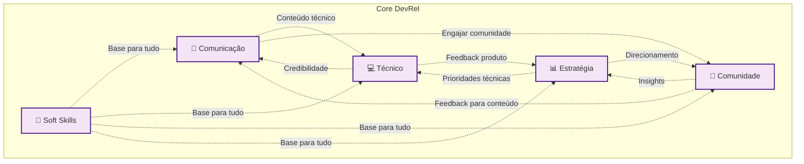

# 🗺️ Roadmap Visual DevRel - Versões Alternativas

Este arquivo contém diferentes visualizações do roadmap para diferentes necessidades.

## 📊 Versão Detalhada por Competências

## 🎯 Versão por Jornada de Aprendizado

## 📈 Versão por Níveis de Proficiência

```mermaid
graph LR
    subgraph "🌱 Iniciante (0-6 meses)"
        A1[Entender DevRel]
        A2[Comunicação básica]
        A3[Git/GitHub]
        A4[Primeiras interações]
    end
    
    subgraph "🌿 Intermediário (6-18 meses)"
        B1[Criar conteúdo regular]
        B2[Participar eventos]
        B3[Coletar feedback]
        B4[Métricas básicas]
    end
    
    subgraph "🌳 Avançado (18+ meses)"
        C1[Liderar comunidade]
        C2[Influenciar produto]
        C3[Estratégia DevRel]
        C4[Mentorar outros]
    end
    
    A1 --> A2 --> A3 --> A4
    A4 --> B1 --> B2 --> B3 --> B4
    B4 --> C1 --> C2 --> C3 --> C4
    
    classDef iniciante fill:#e8f5e8,stroke:#2e7d32
    classDef intermediario fill:#fff3e0,stroke:#f57f17
    classDef avancado fill:#e3f2fd,stroke:#1565c0
    
    class A1,A2,A3,A4 iniciante
    class B1,B2,B3,B4 intermediario
    class C1,C2,C3,C4 avancado
```

## 🔄 Versão Interconectada (Trilhas que se Complementam)

## 🎯 Como Usar Estas Visualizações

- **Diagrama Principal**: Visão geral do fluxo de aprendizado
- **Mindmap**: Explorar competências específicas
- **Journey**: Entender a progressão temporal
- **Níveis**: Avaliar onde você está
- **Interconectada**: Ver como as trilhas se complementam

Cada visualização serve para um propósito diferente no seu aprendizado!
